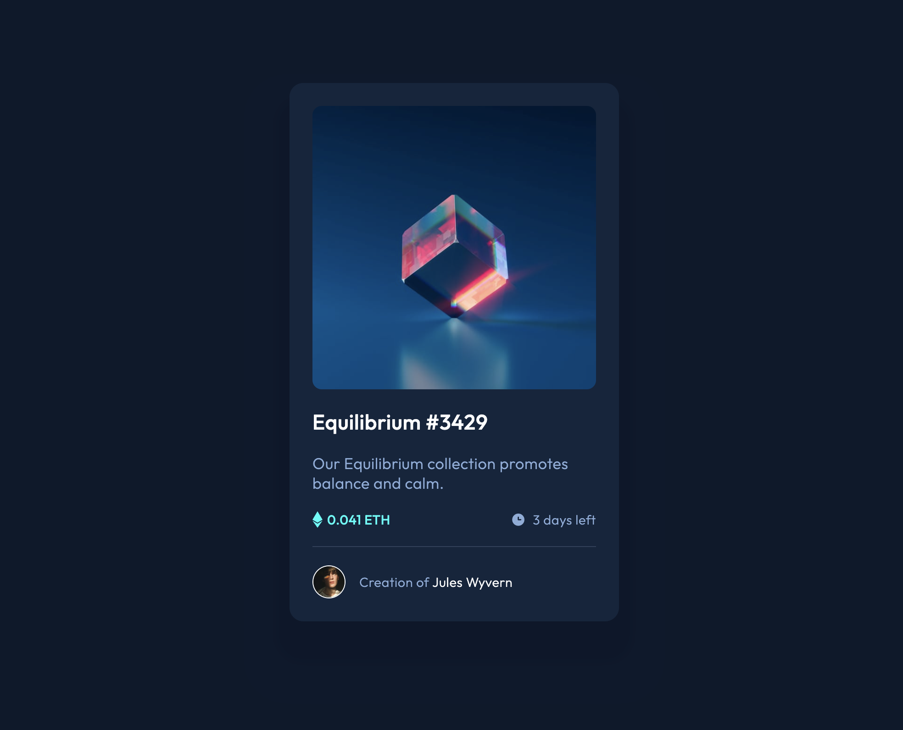

# Frontend Mentor - NFT preview card component solution

This is a solution to the [NFT preview card component challenge on Frontend Mentor](https://www.frontendmentor.io/challenges/nft-preview-card-component-SbdUL_w0U). Frontend Mentor challenges help you improve your coding skills by building realistic projects.

## Table of contents

- [Overview](#overview)
  - [Screenshot](#screenshot)
  - [Links](#links)
- [My process](#my-process)
  - [Built with](#built-with)
  - [What I learned](#what-i-learned)
  - [TODO](#TODO)
  - [Useful resources](#useful-resources)
- [Author](#author)

## Overview

### Screenshot



### Links

- [Solution URL](https://github.com/MawsFr/nft-preview-card-component)
- [Live Site URL](https://mawsfr.github.io/nft-preview-card-component/)

## My process

### Built with

- Semantic HTML5 markup
- CSS custom properties
- Flexbox

### What I learned

I've learned that I can put more than one shadow on an element with the `box-shadow` property.

```css
.card {
  box-shadow: 0px 30px 10px 15px rgb(12, 23, 42),
    0px 40px 10px 50px rgb(13, 25, 44);
  ...
}
```

### TODO

Learn more about :

* SCSS
* em / rem
* media queries
* Tailwind CSS
* BEM

### Useful resources

- [Flexbox Zombie](mastery.games/flexboxzombies) - This game made me practice Flexbox a lot.
- [Flexbox froggy](https://flexboxfroggy.com/) - Another game to learn Flexbox.
- [Learn Flexbox the easy way](https://www.youtube.com/watch?v=u044iM9xsWU) - A video that gave me a good understanding of flexbox.

## Author

- Website - [Mustapha NEZZARI](https://mawsfr.github.io/)
- Frontend Mentor - [@MawsFr](https://www.frontendmentor.io/profile/MawsFr)
- Twitter - [@mustaphanezzari](https://twitter.com/mustaphanezzari)
